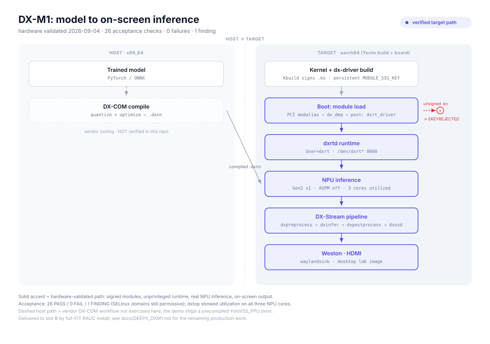

# AI Acceleration — Architecture

What gets built where, and by whom, for an AI accelerator on this distro —
using DEEPX DX-M1 as the concrete, currently-integrated example. Read
[AI_ACCELERATION_101.md](AI_ACCELERATION_101.md) first if the vocabulary
(NPU, quantization, ONNX, model compiler vs. runtime) isn't already
familiar.

**Status note:** the target path shown below is hardware-validated. The project
image completed real inference with non-zero DX-M1 utilization, passed 25
acceptance checks with zero failures from a clean full-FIT RAUC installation on
slot B, and required no target-side hand edits. The dashed host-side DX-COM
workflow remains outside this repository and has not been exercised here.
[DEEPX_DXM1.md](DEEPX_DXM1.md) is the authoritative source for versions,
evidence, and remaining production work.

## The pipeline

<picture>
  <source media="(prefers-color-scheme: dark)" srcset="diagrams/dxm1-pipeline.dark.svg">
  
</picture>

Two zones, because two different machines are involved, and understanding
that split is most of what makes this architecture legible (see
[AI_ACCELERATION_101.md §3](AI_ACCELERATION_101.md#3-the-two-machine-mental-model)
for why it's split this way at all).

### HOST (x86_64) — general DX-M1 capability, not exercised by this repo

- **Trained model** — PyTorch/ONNX, from wherever the model came from.
- **DX-COM compile** (dashed in the diagram — deliberately: DX-COM's
  x86_64-host-only, aarch64-target-excluded split *is* vendor-documented
  (DEEPX's own compiler/runtime support matrix states it directly), but
  nobody on this project has run it, on any host. Dashed here means "not
  exercised by us," not "unsourced" — the claim itself is on solid ground).
  Quantizes and optimizes the model into a `.dxnn` binary.

Only the compiled `.dxnn` file crosses to the target. Nothing else does —
not the ONNX source, not the calibration data, not the compiler itself.

### TARGET (aarch64 — this Yocto build, and the running board)

- **Kernel + `dx-driver` build.** The out-of-tree NPU driver is compiled
  against this distro's kernel. Signing happens *here*, not as a separate
  step: this kernel sets `CONFIG_MODULE_SIG_ALL=y`, so **Kbuild itself**
  signs the `.ko` as part of the driver's own `modules_install` — the
  project's `iotgw-kernel-module-signing.bbclass` only *verifies* the
  result (checks for the signature trailer, fails the build if it's
  missing). There is exactly one signing authority; a second signer would
  risk corrupting or shadowing the first.
- **Boot: PCI enumeration and module load.** The BCM2712 PCIe host controller
  is built in (`CONFIG_PCIE_BRCMSTB=y`). When it enumerates the endpoint, the
  PCI modalias loads `dx_dma`; the vendor's `softdep dx_dma post:
  dxrt_driver` then loads the character-device module after probe. There is
  deliberately no forced `modules-load.d` entry. Every image enforces module
  signatures with `CONFIG_MODULE_SIG_FORCE=y`; a module signed by an unknown
  key is rejected with `EKEYREJECTED`.
- **`dxrtd` runtime.** Runs as a dedicated `dxrt` user, not root, with
  `/dev/dxrt*` at `0660 root:dxrt` — narrower than upstream's default
  world-writable `0666`. Ordered after module load; gated on
  `/dev/dxrt*` actually existing, so a board with no card fitted doesn't
  crash-loop.
- **NPU inference.** Over a Gen2 x1 PCIe link. The lane width is fixed by the
  Raspberry Pi 5 external FFC connector. DX-M1 images disable ASPM because an
  on-target single-variable test showed that L1 power-state transitions caused
  endpoint resets, correctable PCIe errors, and fatal config-space accesses;
  with ASPM off, resets and AER errors remained at zero.

The solid accent path in the diagram — PCI enumeration → module load →
runtime → inference — is both project-specific and now verified on hardware.
The dashed host compiler path is the general DEEPX platform capability that
this repo neither builds nor verifies.

### Confirming it's actually running, not silently falling back to CPU

The failure mode to design against: a broken NPU path that still produces
plausible-looking output because inference quietly ran on the CPU instead.
"It printed a detection" is not evidence the accelerator did anything. The
runtime ships tools that give independent signals instead of one:

| Tool | What it shows | Why it matters |
|---|---|---|
| `dxtop` | Real-time NPU utilization | **The load-bearing signal.** Non-zero utilization *during* a run is the one thing a CPU fallback can't fake — a silent fallback still prints a result, but it never moves this needle. |
| `dxrt-cli -s` | Device status | Confirms the runtime sees the card as attached and ready, independent of any particular inference run. |
| `dxrt-cli --errorstat` | PCIe error counters | Distinguishes "ran, and ran cleanly" from "ran, but the link is throwing errors" — relevant given the single-lane connector above. |
| `run_model` | Model-level latency | A number, not just a pass/fail — a model "running" at CPU-only speed is a different finding than one hitting expected NPU latency. |

Worth naming these here specifically because they're the kind of
operational knowledge that doesn't show up in a build log or a recipe —
knowing `dxtop` exists, and *why* it's the tool that actually proves
something ran on silicon, is exactly what a colleague new to this hardware
won't discover on their own.

## What's built by whom

| Layer | Provides | Maintained by |
|---|---|---|
| `meta-deepx-m1` (upstream) | Driver source, DX-RT runtime source, GStreamer plugin, demo apps | DeepX — pinned, never edited in place |
| `meta-iot-gateway` (this repo) | Signature verification, kernel symbol whitelist, Raspberry Pi MSI mode, PCIe/ASPM policy, service/device policy, feature gate, acceptance tooling, and matched full-FIT bundles | This project |
| Off-device entirely | DX-COM, training pipeline, calibration data | Not this repo's concern — host tooling |

The project-side work exists because a hardened, FIT-signed, module-signing-
enforced Yocto BSP is not what most vendor SDKs are written against. See
[DEEPX_DXM1.md §"Delivery and production status"](DEEPX_DXM1.md#7-delivery-and-production-status)
for the gaps that remain.

## Two gates, not one

Nothing about DX-M1 reaches an image just because the layer is composed.
There are two independent switches, and conflating them is the most common
way to accidentally ship a proprietary driver in a build that wasn't meant
to have it:

| Gate | Mechanism | What it controls |
|---|---|---|
| Layer availability | `kas/deepx.yml` composed | Whether `meta-deepx-m1` parses at all |
| Feature enablement | `IOTGW_ENABLE_DEEPX_DXM1` (default `0`) | Whether the kernel symbol whitelist and the packagegroup actually apply |

Both live in the same `kas/deepx.yml` overlay (one file doing both jobs is
this repo's established convention — see `kas/tpm.yml` for the precedent),
but they're semantically distinct: composing the layer with the feature
toggle at `0` still builds, with the driver absent.

## Extending this to a second accelerator vendor

This shape — a pinned upstream layer plus a project-side gate and glue —
isn't DX-M1-specific, and was deliberately kept that way. If a second
accelerator (a different PCIe M.2 NPU, say) were added later, the reusable
pieces are:

- **The `IOTGW_ENABLE_*` gating pattern** — a second
  `IOTGW_ENABLE_<VENDOR>` toggle, same shape, no special-casing.
- **`iotgw-kernel-module-signing.bbclass`** — already written generically;
  any future out-of-tree driver recipe just `inherit`s it.
- **The `CONFIG_TRIM_UNUSED_KSYMS` fix pattern** — the *specific* symbols
  a different driver needs would differ, but the surgical
  `CONFIG_UNUSED_KSYMS_WHITELIST` approach (scoped to that vendor's
  feature flag, not dropped globally) is the template, not a DX-M1-only
  fix.
- **`dynamic-layers/<upstream-layer>/`** — the mechanism (`BBFILES_DYNAMIC`
  scoped bbappends, inert when the overlay isn't composed) that lets this
  repo's glue target an optional upstream layer without a hard dependency.

What would need a real decision, not a copy-paste, if a second vendor
actually arrived: a shared "which accelerator is populated" concept (there
isn't one yet, deliberately — with a single vendor, guessing at that
abstraction risks building the wrong one), and, if on-device inference
needed sandboxing per accelerator, a rootless-container device-passthrough
pattern for the consuming service — a dedicated non-interactive service
account plus a systemd Quadlet passing the device node through, rather than
running the runtime with interactive-user privileges. Neither exists in
this repo today; recorded here as the shape to reach for, not as a promise
either is imminent.

## See also

- [AI_ACCELERATION_101.md](AI_ACCELERATION_101.md) — vocabulary and the
  two-machine mental model, for readers new to this domain.
- [DEEPX_DXM1.md](DEEPX_DXM1.md) — the technical reference: exact build
  commands, acceptance evidence, firmware boundary, the ksym-whitelist trap,
  licensing, and remaining production work.
- [FIT_BOOT_SIGNING.md](FIT_BOOT_SIGNING.md) — the operator-held signing-key
  model a future persistent module-signing key is meant to mirror.
- [KERNEL.md](KERNEL.md) — kernel config, fragments, device-tree policy.
